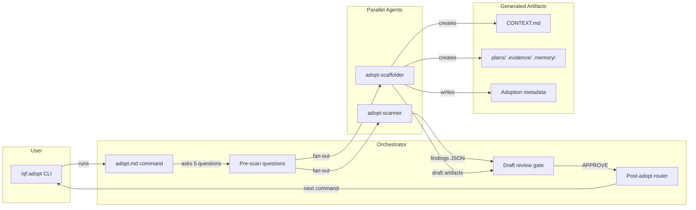

# Milestone 1 — Design: Core Adopt Flow

## Architecture Overview



## Chosen Option: Lightweight Fan-Out Orchestrator

### Rationale
Adopt is a **read-then-generate** workflow, fundamentally different from cook's **plan-then-build** pipeline. A standalone command with its own simple orchestration avoids:
- Forcing read-only agents into cook's write-heavy stage slots
- Inheriting TDD/ownership/worktree machinery that doesn't apply
- Coupling adopt's evolution to cook's evolution

### Flow

```
/qf:adopt
  → Phase 1: Pre-scan (5 interactive questions — project type, primary language, monorepo?, test setup, doc expectations)
  → Phase 2: Fan-out — spawn 2 parallel agents:
      ├── adopt-scanner: reads codebase, produces structured findings
      └── adopt-scaffolder: creates dirs + CONTEXT.md draft from scanner findings
  → Phase 3: Fan-in — merge results, mark all artifacts DRAFT
  → Phase 4: Present drafts for user review
  → Phase 5: Approval gate → finalize → route to next command
```

### Agent Design

**adopt-scanner** (agent type: `planner`, model: `sonnet`)
- Input: project root path + pre-scan answers
- Reads: manifest files, entry points, config, directory tree, README
- Output: structured findings object:
  - `tech_stack`: languages, frameworks, databases, build tools
  - `project_structure`: pattern (monolith/microservices/monorepo), key dirs, entry points
  - `conventions`: naming, file organization, test patterns
  - `gaps`: missing tests, missing docs, non-standard patterns
- Does NOT write files — returns findings to orchestrator

**adopt-scaffolder** (agent type: `fullstack-developer`, model: `sonnet`)
- Input: scanner findings + pre-scan answers
- Creates: `plans/{slug}/`, `.evidence/`, `.memory/` directories
- Generates: CONTEXT.md using exact same schema as `/qf:0-init`
- Detects existing QuangFlow artifacts (partial adoption) — skips/merges
- Additive only — never overwrites existing project files
- Marks all output as `status: DRAFT`

### Data Contract: Scanner → Scaffolder

Scanner produces findings; scaffolder consumes them. In M1, the orchestrator (adopt.md) passes scanner output directly to the scaffolder prompt. No intermediate file.

```yaml
# Scanner findings schema
tech_stack:
  languages: ["TypeScript", "Python"]
  frameworks: ["Next.js", "FastAPI"]
  databases: ["PostgreSQL"]
  build_tools: ["npm", "Docker"]
  package_managers: ["npm", "pip"]

project_structure:
  pattern: "monolith"  # monolith | microservices | monorepo
  key_directories:
    - path: "src/"
      purpose: "Main source code"
    - path: "tests/"
      purpose: "Test files"
  entry_points: ["src/index.ts", "src/main.py"]
  total_files: 127

conventions:
  naming: "camelCase for files, PascalCase for components"
  file_organization: "feature-based (src/features/)"
  test_pattern: "co-located (__tests__/ next to source)"
  existing_docs: ["README.md", "docs/api.md"]

gaps:
  - type: "no_tests"
    detail: "No test files found"
  - type: "no_ci"
    detail: "No CI/CD configuration detected"
```

### CONTEXT.md Compatibility

Adopt's CONTEXT.md uses the **exact same schema** as `/qf:0-init` Step 4:

```yaml
quangflow_version: "2.0.0"
pm_mode: hands-on
project_type: existing
scan_depth: full        # new depth level for adopt
adopted: true           # flag for downstream phases
adopted_at: ISO-8601
created: ISO-8601
```

The `adopted: true` flag lets downstream phases know this project was adopted (not greenfield). The `scan_depth: full` is a new value alongside shallow/medium/deep.

### Approval Flow (REQ-004)

```
1. Present draft CONTEXT.md to user
2. Present scanner gap findings (missing tests, docs, etc.)
3. Ask: "Review the drafts above. Type APPROVE to finalize, or describe what to change."
4. If rejected: re-run specific agent with user feedback
5. If approved: remove DRAFT status, write final artifacts
```

### Post-Adopt Routing (REQ-005)

After approval:
```
"Adoption complete. Your project is now QuangFlow-ready.

What's next?
1. /qf:1-brainstorm — Plan a new feature on top of this project
2. /qf:5-maintain — Enter maintenance mode (scan for bugs, monitor logs)
```

Store adoption metadata in CONTEXT.md `## Locked Decisions`:
```
- Adopted on {date} via /qf:adopt
- Tech stack detected: {summary}
- Scan found {N} gaps (logged in CONTEXT.md → Constraints)
```

### Error Handling (REQ-001)

- If scanner agent fails: present partial results + error, let user retry or proceed with what's available
- If scaffolder fails: scanner findings are still shown, user can manually create dirs
- If project has no recognizable structure: scanner returns `gaps` with `type: "unrecognized_structure"`, scaffolder creates minimal CONTEXT.md with `⚠️ ASSUMPTION` callouts

### Edge Case: Partial Adoption

Before scanning, check for existing artifacts:
```
plans/ exists?          → "Found existing plans/. Merge or skip?"
CONTEXT.md exists?      → "Found existing CONTEXT.md. Update or keep?"
.memory/ exists?        → "Found existing .memory/. Preserve and extend."
.evidence/ exists?      → Skip — always preserve
```

## Rejected Options

### Option B: Cook-Compatible Pipeline
Rejected because cook's pipeline assumes write-heavy work (TDD, file ownership, worktrees) — all irrelevant for scanning. Forcing scan agents into cook's stage slots would be awkward and create coupling risk. Changes to cook could break adopt.

### Option C: Enhanced /qf:0-init
Rejected because 0-init is already complex. Adding agent orchestration, draft review, and approval gates would turn it into a god-command. "Adopt" is conceptually different from "init" — conflating them confuses the user's mental model and makes M2 extensions (feature extraction, doc generation) much harder.

## Tension Resolution

1. **Read-heavy vs write-heavy** → Resolved by standalone orchestrator (not reusing cook)
2. **Artifact compatibility** → Resolved by using exact same CONTEXT.md schema as 0-init
3. **Parallel agents with no coordination** → Resolved by fan-out/fan-in with orchestrator as mediator
4. **CONTEXT.md schema lock-in** → Resolved by adding only 2 new fields (`adopted`, `scan_depth: full`) that are backward-compatible

## Scalability Assessment

- **10x files**: Scanner agent reads more files but produces same output schema. M2 adaptive sizing will handle this.
- **100x files**: Requires M2's smart sampling. M1 will work but may be slow/expensive on very large projects.
- **Team scale**: No conflicts — agents are read-only. Adding more scanners in M2 is trivial fan-out.
- **Feature extension (M2)**: Easy — add `adopt-feature-extractor` and `adopt-doc-generator` as additional fan-out agents. Synthesis step merges all findings before scaffolding.
