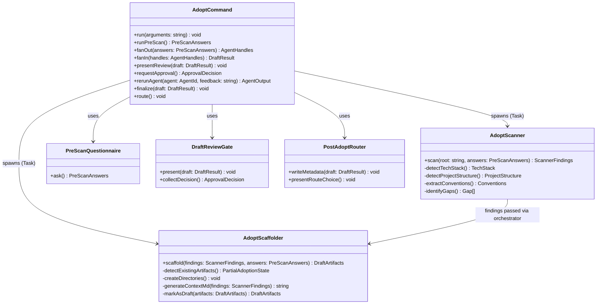

# MODULES — /qf:adopt Milestone 1

## Module Boundaries

---

## Module 1: adopt-command (Orchestrator)

**File:** `commands/qf/adopt.md`
**Also copied to:** `plugins/quangflow/commands/qf/adopt.md`

### Responsibilities
- Parse arguments (none required; future: `--skip-prescan`, `--shallow`)
- Run pre-scan questionnaire (inline, 5 questions)
- Fan-out: call `Task()` for adopt-scanner and adopt-scaffolder in parallel
- Fan-in: collect both agent outputs, mark all artifacts DRAFT
- Partial error handling: if scanner fails, pass empty findings with error flag to scaffolder
- Present draft review gate, collect APPROVE or feedback
- If rejected: re-run specific agent with feedback, loop back to review
- If approved: call finalize, then call router

### Public Interfaces
- Entry: invoked by user via `/qf:adopt`
- Calls: `adopt-scanner` agent, `adopt-scaffolder` agent
- Reads: none (fresh start)
- Writes: orchestrates writes via scaffolder; writes adoption metadata to CONTEXT.md `## Locked Decisions` on finalize

### Boundaries (what this module does NOT do)
- Does NOT perform codebase scanning directly
- Does NOT write CONTEXT.md or create directories directly
- Does NOT auto-advance past the approval gate

---

## Module 2: adopt-scanner

**File:** `agents/adopt-scanner.md`
**Also copied to:** `plugins/quangflow/agents/adopt-scanner.md`

### Responsibilities
- Receive: project root path + PreScanAnswers from orchestrator
- Read manifest files (package.json, requirements.txt, go.mod, Cargo.toml, pyproject.toml, etc.)
- List directory tree (top-level + src/ level)
- Read README.md, CLAUDE.md if present
- Read main entry points (index.ts, main.py, app.ts, server.ts, etc.)
- Read config files (tsconfig.json, docker-compose.yml, .env.example)
- Detect tech stack: languages, frameworks, databases, build tools, package managers
- Detect project structure pattern: monolith | microservices | monorepo
- Map key directories with purpose
- Extract conventions: naming, file organization, test patterns, existing docs
- Identify gaps: no_tests, no_docs, no_ci, unrecognized_structure
- Return: structured ScannerFindings YAML to orchestrator

### Public Interfaces
- Input: `PreScanAnswers` + project root path (from orchestrator prompt)
- Output: `ScannerFindings` YAML block (in agent response — no file write)
- See CONTRACTS.md → Scanner Findings Schema

### Boundaries (what this module does NOT do)
- Does NOT write any files
- Does NOT create directories
- Does NOT make assumptions without marking them `⚠️ ASSUMPTION:` in findings

---

## Module 3: adopt-scaffolder

**File:** `agents/adopt-scaffolder.md`
**Also copied to:** `plugins/quangflow/agents/adopt-scaffolder.md`

### Responsibilities
- Receive: ScannerFindings (or empty + error flag if scanner failed) + PreScanAnswers
- Check for existing QuangFlow artifacts (partial adoption detection):
  - `plans/` exists → offer merge or skip
  - `CONTEXT.md` exists → offer update or keep
  - `.memory/` exists → preserve and extend
  - `.evidence/` exists → always preserve
- Create directories: `plans/`, `.evidence/`, `.memory/`
- Generate CONTEXT.md using `/qf:0-init` Step 4 schema + `adopted: true` + `scan_depth: full`
- Mark all output with `status: DRAFT`
- Never overwrite existing project files (additive only)
- Return: DraftArtifacts summary to orchestrator

### Public Interfaces
- Input: `ScannerFindings` + `PreScanAnswers` (from orchestrator prompt)
- Output: `DraftArtifacts` summary (CONTEXT.md path, dirs created, partial adoption flags)
- See CONTRACTS.md → CONTEXT.md Output Schema, Partial Adoption Contract

### Boundaries (what this module does NOT do)
- Does NOT scan the codebase (scanner already did this)
- Does NOT write to existing project source files
- Does NOT finalize artifacts (remains DRAFT until orchestrator approves)

---

## Module 4: Pre-scan Questionnaire (inline in adopt-command)

### Responsibilities
- Ask 5 questions before spawning agents (see CONTRACTS.md → Pre-Scan Questions Contract)
- Collect answers as PreScanAnswers object
- Pass answers to both scanner and scaffolder

### Boundaries
- Inline in adopt.md — not a separate agent or file
- Questions are fixed (not configurable in M1)

---

## Module 5: Draft Review Gate (inline in adopt-command)

### Responsibilities
- Present CONTEXT.md draft to user (formatted, readable)
- Present scanner gap findings as summary list
- Prompt: "Type APPROVE to finalize, or describe what to change."
- If feedback given: determine which agent(s) to re-run (scanner, scaffolder, or both)
- Loop until APPROVE received

### Boundaries
- Inline in adopt.md — not a separate agent
- Re-run is always targeted (not full re-scan unless user explicitly requests it)

---

## Module 6: Post-Adopt Router (inline in adopt-command)

### Responsibilities
- Remove DRAFT status from all artifacts
- Write adoption metadata to CONTEXT.md `## Locked Decisions`
- Present route choice to user: `/qf:1-brainstorm` or `/qf:5-maintain`

### Boundaries
- Inline in adopt.md — not a separate agent
- Does not auto-navigate (user must choose the next command)
