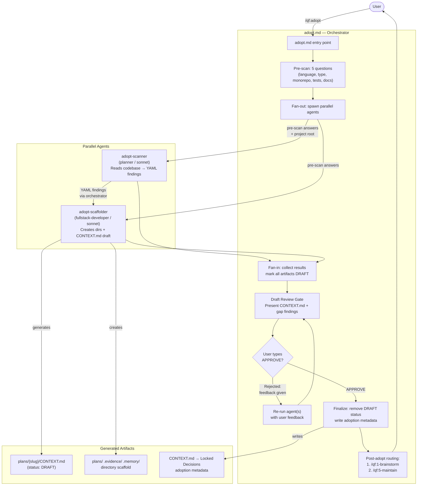

# OVERVIEW — /qf:adopt Milestone 1

## System Components

| Component | Type | Responsibility |
|-----------|------|----------------|
| `adopt.md` | Command / Orchestrator | Entry point. Runs pre-scan questions, fans out to agents, fans in results, presents review gate, routes post-approval. |
| `adopt-scanner` | Agent (planner / sonnet) | Read-only codebase analysis. Produces structured YAML findings. No file writes. |
| `adopt-scaffolder` | Agent (fullstack-developer / sonnet) | Creates QuangFlow directory scaffold and CONTEXT.md draft from scanner findings. Additive only. |
| Pre-scan Questionnaire | Inline step in adopt.md | 5 interactive questions collected before agents spawn. Results passed as context to both agents. |
| Draft Review Gate | Inline step in adopt.md | Presents DRAFT artifacts to user. Accepts APPROVE or feedback. Re-runs specific agents on rejection. |
| Post-Adopt Router | Inline step in adopt.md | After approval, presents `/qf:1-brainstorm` vs `/qf:5-maintain` choice and stores metadata. |

---

## System Flowchart

---

## Key Design Decisions

- **Scanner is read-only**: never writes files. Returns findings directly to orchestrator via agent output.
- **Scaffolder receives scanner findings**: orchestrator passes findings in scaffolder's prompt context — no intermediate file needed in M1.
- **Standalone command, not reusing cook**: adopt is read-then-generate, not plan-then-build. No TDD, no file ownership, no worktree isolation needed.
- **CONTEXT.md schema compatibility**: exact same schema as `/qf:0-init` Step 4 with two additive fields (`adopted: true`, `scan_depth: full`).
- **Error resilience**: if scanner fails, scaffolder still runs with pre-scan answers only. Partial results surfaced to user.
