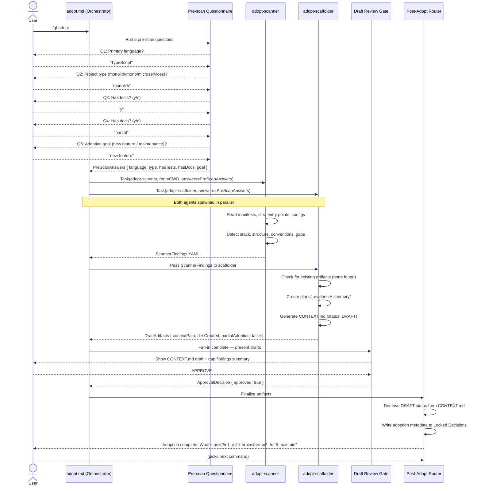
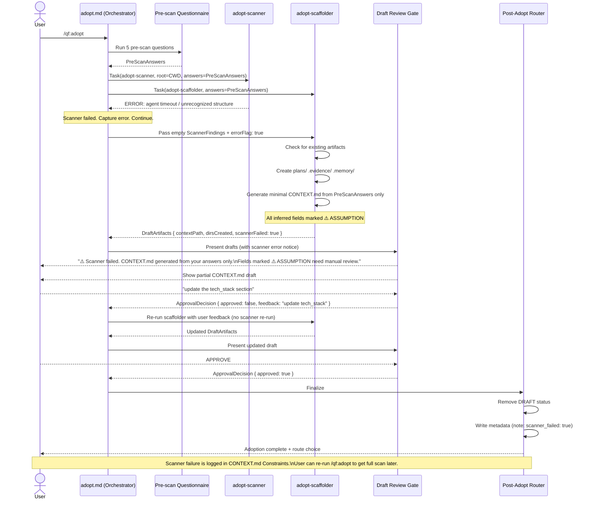
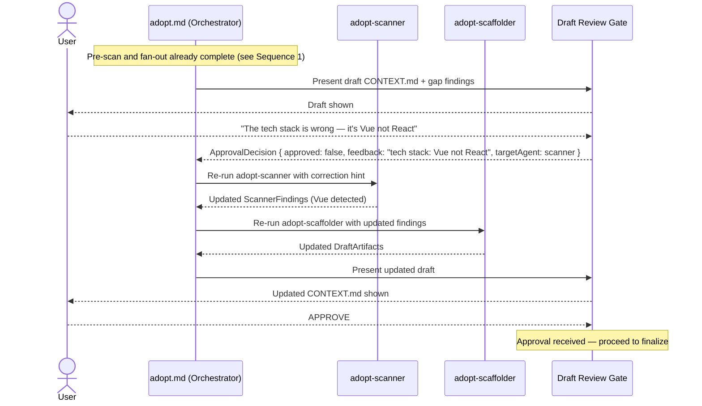

# SEQUENCES — /qf:adopt Milestone 1

## Sequence 1: Happy Path — Full Adopt Flow



---

## Sequence 2: Partial Adoption — Existing Artifacts Detected

```mermaid
sequenceDiagram
    actor User
    participant CMD as adopt.md (Orchestrator)
    participant QA as Pre-scan Questionnaire
    participant SCAN as adopt-scanner
    participant SCAFF as adopt-scaffolder
    participant GATE as Draft Review Gate
    participant ROUTER as Post-Adopt Router

    User->>CMD: /qf:adopt

    CMD->>QA: Run 5 pre-scan questions
    QA-->>CMD: PreScanAnswers

    CMD->>SCAN: Task(adopt-scanner, root=CWD, answers=PreScanAnswers)
    CMD->>SCAFF: Task(adopt-scaffolder, answers=PreScanAnswers)
    Note over CMD,SCAFF: Both agents spawned in parallel

    SCAN-->>CMD: ScannerFindings YAML
    CMD->>SCAFF: Pass ScannerFindings

    SCAFF->>SCAFF: Check for existing artifacts
    Note over SCAFF: Found: plans/ (existing), CONTEXT.md (existing), .memory/ (existing)

    SCAFF-->>User: "Found existing plans/ — merge or skip?"
    User-->>SCAFF: "merge"
    SCAFF-->>User: "Found existing CONTEXT.md — update or keep?"
    User-->>SCAFF: "update"
    Note over SCAFF: .memory/ preserved automatically; .evidence/ always preserved

    SCAFF->>SCAFF: Merge plans/ content (additive only)
    SCAFF->>SCAFF: Update CONTEXT.md (preserve existing fields, add adopted: true)
    SCAFF->>SCAFF: Extend .memory/ with new findings
    SCAFF-->>CMD: DraftArtifacts { contextPath, mergedDirs: [plans, memory], partialAdoption: true }

    CMD->>GATE: Present drafts (with merge summary)
    GATE-->>User: Show updated CONTEXT.md + merge report + gap findings
    User-->>GATE: APPROVE

    GATE-->>CMD: ApprovalDecision { approved: true }
    CMD->>ROUTER: Finalize
    ROUTER->>ROUTER: Remove DRAFT status
    ROUTER->>ROUTER: Write adoption + merge metadata to Locked Decisions
    ROUTER-->>User: Adoption complete + route choice
```

---

## Sequence 3: Error Path — Scanner Fails, Scaffolder Continues



---

## Sequence 4: Rejection Loop — User Requests Changes


