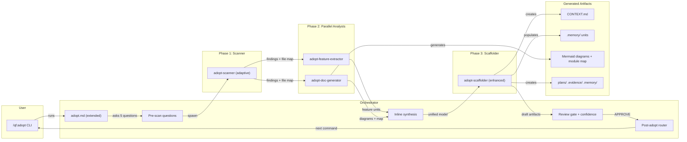

# Milestone 2 — Design: Deep Analysis & Memory

## Architecture Overview



## Chosen Option: Sequential Pipeline (Scanner → Parallel Analysts → Synthesis)

### Rationale

M2 adds feature extraction (REQ-006), doc generation (REQ-007), adaptive scanning (REQ-008), synthesis (REQ-009), and confidence scoring (REQ-010) to the existing M1 flow. The sequential pipeline is the natural extension of M1's fan-out pattern:

- Scanner provides a **shared file map** that prevents duplicate discovery work
- Feature extractor and doc generator run **in parallel** for speed
- Synthesis stays **inline in the orchestrator** — one fewer agent to manage
- Scaffolder is enhanced to write `.memory/` units and integrate doc outputs

### Flow (M2 Enhanced)

```
/qf:adopt (M2)
  → Step 1: Feature slug (same as M1)
  → Step 2: Pre-scan questions (same as M1)
  → Step 3: Phase 1 — Scanner (adaptive sizing) runs FIRST
      - Determines project size tier: small (<50), medium (50-500), large (500+)
      - Applies tier-appropriate scan strategy
      - Returns ScannerFindings + FileMap (new: list of files read + files skipped with reasons)
  → Step 4: Phase 2 — Feature extractor + Doc generator run in PARALLEL
      - Both receive ScannerFindings + FileMap
      - Both can do targeted deep reads beyond scanner's map
  → Step 5: Phase 3 — Inline synthesis in orchestrator
      - Reconciles feature list, module count, naming
      - Resolves conflicts (majority vote or flag as low-confidence)
      - Produces UnifiedProjectModel
  → Step 6: Phase 4 — Enhanced scaffolder
      - Consumes UnifiedProjectModel
      - Creates dirs + CONTEXT.md (same as M1)
      - Populates .memory/ with Feature Memory Units (NEW)
      - Integrates doc generator output into project (NEW)
  → Step 7: Review gate (enhanced with confidence scores per artifact)
  → Step 8: Finalize → route (same as M1)
```

### Agent Design

**adopt-scanner (upgraded — REQ-008)**
- Agent type: `planner`, model: `sonnet`
- NEW: Adaptive sizing strategy:
  ```
  small  (<50 files):  read ALL files — full scan
  medium (50-500):     read key files (manifests, entry points, configs, tests) + sample 20% of source files
  large  (500+):       smart sampling — entry points, configs, key modules, tests only (~100 files max)
  ```
- NEW: Returns `FileMap` alongside `ScannerFindings`:
  ```yaml
  file_map:
    total_files: 0           # total project files detected
    tier: ""                 # "small" | "medium" | "large"
    files_read: []           # string[] — files actually read
    files_sampled: []        # string[] — files sampled (medium/large tier)
    files_skipped: []        # string[] — files skipped with reason
    scan_coverage: ""        # percentage estimate, e.g. "100%", "35%", "12%"
  ```
- NEW: Reports scan strategy transparency to user (REQ-008: "scanning strategy is transparent")
- Existing M1 output schema is preserved (backward-compatible)

**adopt-feature-extractor (new — REQ-006)**
- Agent type: `planner`, model: `sonnet`
- Input: ScannerFindings + FileMap + PreScanAnswers
- Reads: Source files identified by scanner as key modules/entry points. Can do supplemental reads (up to 20 additional files beyond scanner's map) for function/class boundary analysis.
- Output: `FeatureUnits` — list of detected features:
  ```yaml
  features:
    - name: ""              # feature name (kebab-case)
      description: ""       # what this feature does
      status: ""            # "inferred" | "confirmed"
      confidence: ""        # "high" | "medium" | "low"
      files: []             # string[] — files that implement this feature
      dependencies: []      # string[] — other feature names this depends on
      notes: ""             # any caveats or assumptions
  ```
- Flags features as `inferred` (heuristic) vs `confirmed` (clear signal from file structure or naming)
- Produces one Feature Memory Unit template per feature (populated by scaffolder)

**adopt-doc-generator (new — REQ-007)**
- Agent type: `planner`, model: `sonnet`
- Input: ScannerFindings + FileMap + PreScanAnswers
- Reads: Entry points, interface files, config files. Can do supplemental reads (up to 15 additional files) for dependency graph analysis.
- Output: `DocArtifacts`:
  ```yaml
  component_diagram: ""     # Mermaid source (graph LR component diagram)
  dependency_graph: ""      # Mermaid source (graph TD dependency graph)
  module_map:               # module responsibility descriptions
    - name: ""
      path: ""
      responsibility: ""
      public_interfaces: []
  readme_sections: []       # markdown sections to append (additive only)
  confidence: ""            # "high" | "medium" | "low" — overall doc confidence
  ```
- Creates/updates README sections — **additive only** (does not overwrite existing README content)

**adopt-scaffolder (enhanced — REQ-006, REQ-010)**
- Same as M1, plus:
- NEW: Consumes `UnifiedProjectModel` (synthesis output) instead of raw ScannerFindings
- NEW: Populates `.memory/` with Feature Memory Units from feature extractor output:
  ```
  .memory/
  ├── _index.md              # master registry
  └── {feature-name}/
      ├── CONTEXT.md          # what this feature is, dependencies
      ├── REQUIREMENTS.md     # scoped REQ-IDs (empty — populated later)
      ├── DESIGN.md           # architecture decisions (empty — populated later)
      ├── GOTCHAS.md          # feature-specific lessons (empty)
      ├── HISTORY.md          # key decisions timeline (empty)
      └── LINKS.md            # cross-references
  ```
- NEW: Integrates doc generator Mermaid diagrams into CONTEXT.md `## Project Structure` section
- NEW: All draft artifacts include confidence score badge: `[confidence: high|medium|low]`

### Synthesis Logic (REQ-009 — inline in orchestrator)

After feature extractor and doc generator complete, orchestrator runs synthesis:

1. **Module count reconciliation**: If scanner found N key directories and feature extractor found M features, flag if M > 2*N or M < N/2 (likely misalignment)
2. **Naming reconciliation**: If feature extractor calls something "auth-service" but doc generator calls it "authentication-module", normalize to one name
3. **Dependency reconciliation**: Merge dependency lists from scanner (package-level) and feature extractor (feature-level)
4. **Conflict resolution**: When agents disagree, use majority vote. If 2-way tie, flag as `confidence: low` and present both views to user at review gate
5. **Output**: `UnifiedProjectModel` passed to scaffolder:
   ```yaml
   unified_model:
     scanner_findings: {}    # original ScannerFindings
     file_map: {}            # from scanner
     features: []            # reconciled from feature extractor
     doc_artifacts: {}       # from doc generator
     conflicts: []           # unresolved conflicts for user review
     synthesis_notes: []     # what was reconciled and how
   ```

### Confidence Scoring (REQ-010)

Each agent scores its own output. Scoring rules:

| Signal | Confidence |
|--------|-----------|
| Derived from manifest file (package.json, go.mod) | **high** |
| Derived from config file (tsconfig.json, docker-compose.yml) | **high** |
| Derived from file naming patterns (consistent `*.test.ts` pattern) | **medium** |
| Derived from code analysis (function signatures, class structure) | **medium** |
| Inferred from heuristics (directory names, file count ratios) | **low** |

At review gate, artifacts are grouped by confidence:
```
### High Confidence (auto-detected from clear signals)
- Tech stack: TypeScript, React, PostgreSQL [confidence: high]
- Test framework: Jest [confidence: high]

### Medium Confidence (pattern-based inference)
- Feature: user-auth [confidence: medium] — inferred from src/auth/ directory + JWT imports
- Module map: 5 modules [confidence: medium]

### Low Confidence (heuristic guess — review carefully)
- Feature: analytics [confidence: low] — single file with ambiguous naming
- Project pattern: monolith [confidence: low] — no clear microservice boundaries
```

### Adaptive Sizing Strategy (REQ-008)

```
Step 1: Count total files in project root (recursive, exclude node_modules, .git, dist, build, __pycache__, venv)
Step 2: Determine tier:
  - small  (<50 files):   budget = ALL files
  - medium (50-500 files): budget = manifests + configs + entry points + 20% sample of source
  - large  (500+ files):  budget = manifests + configs + entry points + key modules (up to 100 files)
Step 3: Report tier and budget to user BEFORE scanning begins:
  "Project size: {N} files ({tier} tier). Scanning {budget} files ({coverage}% coverage)."
Step 4: For medium/large, sampling strategy:
  - Always read: manifest files, config files, entry points, README
  - Prioritize: files imported by entry points, test files, interface/type files
  - Sample: random selection from remaining source files
Step 5: Report what was/wasn't scanned after completion:
  "Scanned {read_count} of {total} files. Skipped: {skip_reasons}."
```

Downstream agents (feature extractor, doc generator) get supplemental budgets:
- Feature extractor: +20 files beyond scanner map (targeted reads for function analysis)
- Doc generator: +15 files beyond scanner map (targeted reads for interface analysis)
- Total worst-case reads on large project: ~135 files

### Approval Flow (Enhanced for M2)

Same as M1, with additions:
1. Present CONTEXT.md draft (same as M1)
2. Present **confidence-grouped findings** (NEW — REQ-010)
3. Present **feature memory units preview** (NEW — REQ-006)
4. Present **architecture diagrams** (NEW — REQ-007)
5. Present scanner gap findings (same as M1)
6. Present **synthesis conflicts** if any (NEW — REQ-009)
7. Approval gate: APPROVE / feedback (same as M1)

On rejection, determine which agent to re-run:
| Feedback about... | Re-run |
|-------------------|--------|
| Tech stack, structure, scanning depth | adopt-scanner → then re-run Phase 2 agents |
| Feature detection, memory units | adopt-feature-extractor only |
| Diagrams, module map, README | adopt-doc-generator only |
| CONTEXT.md formatting | adopt-scaffolder only |
| Everything / major rethink | all agents |

### Error Handling (Extended)

| Error | Behavior |
|-------|----------|
| Scanner fails | Same as M1 — non-blocking. Feature extractor + doc generator run with PreScanAnswers only (all output low-confidence) |
| Feature extractor fails | Non-blocking — skip .memory/ population, note in synthesis |
| Doc generator fails | Non-blocking — skip diagrams, note in synthesis |
| Both extractors fail | Scaffolder falls back to M1 behavior (CONTEXT.md only, no .memory/) |
| Synthesis finds irreconcilable conflicts | Present conflicts to user at review gate with both views |

### Cross-Milestone Compatibility

- M1's `adopt.md` command is **extended, not replaced** — M2 adds Steps 4-5 (Phase 2 + synthesis) between M1's scanner and scaffolder steps
- M1's `ScannerFindings` schema is **preserved** — `FileMap` is additive (new key alongside existing schema)
- M1's `DraftArtifacts` schema is **extended** — new fields for features, docs, confidence
- M1's `adopt-scanner.md` is **upgraded** — adaptive sizing added, existing scan steps preserved
- M1's `adopt-scaffolder.md` is **enhanced** — .memory/ population and doc integration added
- All M1 contracts remain valid — M2 adds new contracts, does not modify existing ones
- Plugin mirrors must be updated for all modified files

## Rejected Options

### Option B: Parallel Deep-Scan Agents
Rejected because all 3 analysis agents independently scanning the codebase would produce ~3x the file reads. On large projects (500+ files), this is expensive and produces more conflicts for synthesis to reconcile. The sequential pipeline reuses scanner's file map, keeping total reads to ~135 (vs ~300).

### Option C: Guided Fan-Out with Supplemental Budgets (as standalone option)
This was essentially merged into Option A. The supplemental read budget concept (feature extractor +20 files, doc generator +15 files beyond scanner map) is incorporated into the chosen design. As a standalone option with a separate synthesis agent, it added unnecessary agent overhead.

## Tension Resolution

1. **Scanner bottleneck vs parallelism** → Scanner runs first but is fast (reads structure, not content). Phase 2 agents run in parallel. Total time is scanner + max(extractor, generator), not sum of all.
2. **Adaptive sizing vs read budget** → Scanner's adaptive strategy determines the base budget. Downstream agents get explicit supplemental budgets (20 + 15 files). Total is bounded.
3. **Synthesis complexity** → Inline in orchestrator, not a separate agent. Follows 5 clear reconciliation rules. Unresolvable conflicts escalate to user at review gate.
4. **Confidence scoring scope** → Each agent scores its own output. Scaffolder preserves scores. Review gate groups by confidence. No scoring lost through the pipeline.
5. **Cross-milestone compatibility** → All M1 schemas preserved. M2 adds new fields/agents without breaking existing contracts.

## Scalability Assessment

- **10x files (~500)**: Medium tier kicks in. Scanner reads ~120 key files. Extractors add ~35 supplemental reads. Total ~155 reads. Manageable.
- **100x files (~5000)**: Large tier. Scanner samples ~100 files. Extractors add ~35. Total ~135 reads. Accuracy depends on sampling quality.
- **Team scale**: Scanner is single-agent. Phase 2 is parallel. No conflicts.
- **Feature extension**: Adding `adopt-security-scanner` or `adopt-perf-analyzer` = add to Phase 2 fan-out + extend synthesis rules. Pattern is proven.
