# MODULES — /qf:adopt Milestone 2

All M1 modules are preserved. M2 adds two new modules and upgrades three existing modules.

---

## Module Boundaries (M2 Full)

```mermaid
classDiagram
    class AdoptCommand {
        +run(arguments: string) void
        +runPreScan() PreScanAnswers
        +runScanner(answers: PreScanAnswers) ScannerPhaseResult
        +runPhase2Parallel(findings: ScannerPhaseResult) Phase2Result
        +runSynthesis(phase2: Phase2Result) UnifiedProjectModel
        +runScaffolder(model: UnifiedProjectModel) DraftArtifacts
        +presentConfidenceReview(draft: DraftArtifacts) void
        +requestApproval() ApprovalDecision
        +rerunAgent(agent: AgentId, feedback: string) AgentOutput
        +finalize(draft: DraftArtifacts) void
        +route() void
    }

    class AdoptScanner {
        +scan(root: string, answers: PreScanAnswers) ScannerPhaseResult
        -countFiles(root: string) int
        -determineTier(count: int) Tier
        -buildScanBudget(tier: Tier) ScanBudget
        -reportScanStrategy(tier: Tier, budget: ScanBudget) void
        -detectTechStack() TechStack
        -detectProjectStructure() ProjectStructure
        -extractConventions() Conventions
        -identifyGaps() Gap[]
        -buildFileMap(read: string[], sampled: string[], skipped: string[]) FileMap
    }

    class AdoptFeatureExtractor {
        +extract(findings: ScannerFindings, fileMap: FileMap, answers: PreScanAnswers) FeatureUnits
        -detectByDirectory(dirs: KeyDirectory[]) FeatureCandidate[]
        -detectByImports(entryPoints: string[]) FeatureCandidate[]
        -detectByNaming(files: string[]) FeatureCandidate[]
        -scoreFeature(candidate: FeatureCandidate) ConfidenceScore
        -buildFeatureMemoryTemplate(feature: Feature) MemoryTemplate
        -handleNoFeaturesDetected() FeatureUnits
    }

    class AdoptDocGenerator {
        +generate(findings: ScannerFindings, fileMap: FileMap, answers: PreScanAnswers) DocArtifacts
        -generateComponentDiagram(modules: KeyDirectory[]) string
        -generateDependencyGraph(manifests: string[]) string
        -buildModuleMap(dirs: KeyDirectory[]) ModuleMapEntry[]
        -buildReadmeSections(findings: ScannerFindings) string[]
        -scoreDocConfidence(sourceSignal: SignalType) ConfidenceScore
        -handleMinimalProject() DocArtifacts
    }

    class InlineSynthesis {
        +reconcile(features: FeatureUnits, docs: DocArtifacts, scanner: ScannerFindings) UnifiedProjectModel
        -reconcileModuleCount(dirs: KeyDirectory[], features: Feature[]) ConflictOrNil
        -reconcileNaming(features: Feature[], modules: ModuleMapEntry[]) NameMap
        -reconcileDependencies(pkgDeps: string[], featureDeps: string[]) string[]
        -resolveConflict(conflict: Conflict) ConflictResolution
        -buildSynthesisNotes(reconciled: ReconcileLog[]) string[]
    }

    class AdoptScaffolder {
        +scaffold(model: UnifiedProjectModel, answers: PreScanAnswers) DraftArtifacts
        -detectExistingArtifacts() PartialAdoptionState
        -createDirectories() void
        -generateContextMd(model: UnifiedProjectModel) string
        -populateMemoryIndex(features: Feature[]) void
        -populateMemoryUnit(feature: Feature) void
        -embedDiagrams(contextMd: string, docs: DocArtifacts) string
        -addConfidenceBadges(artifacts: DraftArtifacts) DraftArtifacts
        -markAsDraft(artifacts: DraftArtifacts) DraftArtifacts
    }

    class PreScanQuestionnaire {
        +ask() PreScanAnswers
    }

    class DraftReviewGate {
        +present(draft: DraftArtifacts, conflicts: Conflict[]) void
        +collectDecision() ApprovalDecision
        -groupByConfidence(artifacts: DraftArtifacts) ConfidenceGroups
        -displayFeatureMemoryPreview(features: Feature[]) void
        -displayDiagramsInline(docs: DocArtifacts) void
        -displayConflicts(conflicts: Conflict[]) void
    }

    class PostAdoptRouter {
        +writeMetadata(draft: DraftArtifacts) void
        +presentRouteChoice() void
    }

    AdoptCommand --> PreScanQuestionnaire : uses
    AdoptCommand --> AdoptScanner : spawns (Task)
    AdoptCommand --> AdoptFeatureExtractor : spawns (Task) after scanner
    AdoptCommand --> AdoptDocGenerator : spawns (Task) after scanner, parallel
    AdoptCommand --> InlineSynthesis : runs inline
    AdoptCommand --> AdoptScaffolder : spawns (Task) after synthesis
    AdoptCommand --> DraftReviewGate : uses
    AdoptCommand --> PostAdoptRouter : uses
    AdoptScanner --> AdoptFeatureExtractor : findings + fileMap passed via orchestrator
    AdoptScanner --> AdoptDocGenerator : findings + fileMap passed via orchestrator
    InlineSynthesis --> AdoptScaffolder : UnifiedProjectModel passed via orchestrator
```

---

## Module 1: adopt-command (Orchestrator) — UPGRADED

**File:** `commands/qf/adopt.md`
**Plugin mirror:** `plugins/quangflow/skills/qf/adopt/SKILL.md`
**Owner (M2):** dev-orchestrator

### M2 Responsibilities (additions to M1)
- Run scanner FIRST (not in parallel with scaffolder)
- After scanner completes: spawn feature extractor + doc generator in PARALLEL
- After Phase 2 completes: run inline synthesis (5 reconciliation rules)
- Pass UnifiedProjectModel to scaffolder (not raw ScannerFindings)
- Enhanced review gate: confidence-grouped display, feature memory preview, diagrams inline, synthesis conflicts
- Re-run routing table extended for Phase 2 agents (see CONTRACTS.md → Extended Approval Gate)
- Error handling: Phase 2 agent failures are non-blocking

### M1 Responsibilities (unchanged)
- Pre-scan questionnaire (5 questions)
- Fan-in: collect results, mark DRAFT
- Approval loop (APPROVE / feedback)
- Finalize: remove DRAFT, write metadata
- Post-adopt router

### Public Interfaces
- Entry: `/qf:adopt` user invocation
- Calls: `adopt-scanner`, `adopt-feature-extractor`, `adopt-doc-generator`, `adopt-scaffolder`
- Consumes: `ScannerPhaseResult`, `FeatureUnits`, `DocArtifacts`, `DraftArtifacts`
- Produces: `UnifiedProjectModel` (inline), final `CONTEXT.md` adoption metadata

### Boundaries
- Does NOT run synthesis as a separate agent
- Does NOT write `.memory/` directly (delegated to scaffolder)
- Does NOT auto-advance past approval gate

---

## Module 2: adopt-scanner — UPGRADED

**File:** `agents/adopt-scanner.md`
**Plugin mirror:** `plugins/quangflow/agents/adopt-scanner.md`
**Owner (M2):** dev-upgrades

### M2 Additions
- Step 0 (new, runs before M1 scan steps): count files, determine tier, report strategy to user
- Tier logic: `small (<50)` = read all; `medium (50-500)` = manifests + entry points + 20% sample; `large (500+)` = manifests + entry points + key modules (≤100 files)
- Sampling priority: manifest files, config files, entry points, README → files imported by entry points, test files, interface/type files → random from remaining
- Returns `FileMap` alongside `ScannerFindings` (new output key, does not replace any existing field)
- Post-scan transparency report: what was / wasn't scanned

### M1 Responsibilities (unchanged)
- All existing scan steps preserved
- All existing ScannerFindings schema fields preserved

### Public Interfaces
- Input: `PreScanAnswers` + project root path
- Output: `ScannerPhaseResult` = `{ findings: ScannerFindings, file_map: FileMap }`
- See CONTRACTS.md → Scanner Phase Result Schema

### Boundaries
- Does NOT write any files
- Does NOT share file reads with Phase 2 agents (they receive the FileMap, not raw file content)

> ⚠️ ASSUMPTION: Tier boundaries (50, 500) are fixed in M2. If user feedback reveals these are wrong for common project sizes, they should be configurable in a future milestone.

---

## Module 3: adopt-feature-extractor — NEW

**File:** `agents/adopt-feature-extractor.md`
**Plugin mirror:** `plugins/quangflow/agents/adopt-feature-extractor.md`
**Owner (M2):** dev-new-agents

### Responsibilities
- Receive: `ScannerFindings` + `FileMap` + `PreScanAnswers` from orchestrator
- Detection strategy (in priority order):
  1. Directory-based: each top-level source directory = candidate feature
  2. Import-based: trace import graphs from entry points to identify feature clusters
  3. Naming-based: consistent naming patterns (`auth/`, `payments/`) signal features
- Score each feature: `confirmed` (clear signal) vs `inferred` (heuristic)
- Supplemental reads: up to 20 additional files beyond scanner's `FileMap.files_read` (targeted reads for function/class boundary analysis)
- Edge case: no features detected → return single `monolith` feature with `confidence: low`
- Edge case: scanner failed → use PreScanAnswers only, all features `confidence: low`
- Return: `FeatureUnits` YAML to orchestrator (no file writes)

### Public Interfaces
- Input: `ScannerFindings` + `FileMap` + `PreScanAnswers`
- Output: `FeatureUnits`
- See CONTRACTS.md → FeatureUnits Schema

### Boundaries
- Does NOT write any files
- Does NOT modify the scanner's FileMap
- Supplemental reads are budget-capped at 20 files; agent must not exceed this

---

## Module 4: adopt-doc-generator — NEW

**File:** `agents/adopt-doc-generator.md`
**Plugin mirror:** `plugins/quangflow/agents/adopt-doc-generator.md`
**Owner (M2):** dev-new-agents

### Responsibilities
- Receive: `ScannerFindings` + `FileMap` + `PreScanAnswers` from orchestrator
- Generate component diagram (Mermaid `graph LR`): one node per key directory/module, edges from import analysis, subgraphs for layers
- Generate dependency graph (Mermaid `graph TD`): package-level deps from manifests, module-level from imports
- Build module map: name, path, responsibility, public interfaces per module
- Build README sections: markdown blocks to append — **additive only**, include `<!-- Generated by /qf:adopt -->` marker
- Score overall doc confidence based on signal source (manifest → high, import tracing → medium, directory heuristic → low)
- Supplemental reads: up to 15 additional files beyond scanner's FileMap
- Edge case: minimal project with no clear module boundaries → single-component diagram
- Edge case: scanner failed → generate skeleton diagrams from PreScanAnswers, all `confidence: low`
- Return: `DocArtifacts` YAML to orchestrator (no file writes)

### Public Interfaces
- Input: `ScannerFindings` + `FileMap` + `PreScanAnswers`
- Output: `DocArtifacts`
- See CONTRACTS.md → DocArtifacts Schema

### Boundaries
- Does NOT write any files (README sections are returned as strings; scaffolder writes them)
- Does NOT overwrite existing README content
- Supplemental reads are budget-capped at 15 files

---

## Module 5: Inline Synthesis — NEW (not a separate agent)

**Location:** Inline logic in `commands/qf/adopt.md` / `skills/qf/adopt/SKILL.md`
**Owner (M2):** dev-orchestrator

### Responsibilities
Runs as an orchestrator step after Phase 2 agents complete. Applies 5 reconciliation rules:

1. **Module count**: If `|features.length - key_directories.length| > max(features.length, dirs.length) / 2`, flag misalignment
2. **Naming**: If feature extractor and doc generator use different names for the same component, normalize to feature extractor name (it has more context)
3. **Dependencies**: Merge `tech_stack.build_tools` (scanner) + `features[].dependencies` (extractor) into unified dep list
4. **Conflict resolution**: When 2-way disagreement, flag as `confidence: low` conflict, present both views at review gate
5. **Synthesis notes**: Record every reconciliation decision in `synthesis_notes[]` for transparency

### Public Interfaces
- Input: `FeatureUnits` + `DocArtifacts` + `ScannerFindings`
- Output: `UnifiedProjectModel`
- See CONTRACTS.md → UnifiedProjectModel Schema

### Boundaries
- Is NOT a spawned agent (runs inline in orchestrator, no Task() call)
- Does NOT make decisions that could lose user data (conflicts are always surfaced)

---

## Module 6: adopt-scaffolder — UPGRADED

**File:** `agents/adopt-scaffolder.md`
**Plugin mirror:** `plugins/quangflow/agents/adopt-scaffolder.md`
**Owner (M2):** dev-upgrades

### M2 Additions
- Input is now `UnifiedProjectModel` (not raw `ScannerFindings`); falls back to raw `ScannerFindings` if synthesis skipped
- Populate `.memory/` from FeatureUnits:
  - `.memory/_index.md` — master registry listing all detected features
  - `.memory/{feature-name}/CONTEXT.md` — feature description, dependencies, source files
  - `.memory/{feature-name}/REQUIREMENTS.md` — empty, populated in later phases
  - `.memory/{feature-name}/DESIGN.md` — empty
  - `.memory/{feature-name}/GOTCHAS.md` — empty
  - `.memory/{feature-name}/HISTORY.md` — empty
  - `.memory/{feature-name}/LINKS.md` — cross-references to other detected features
  - All memory files marked DRAFT
- Embed component diagram into CONTEXT.md `## Project Structure` section
- Embed dependency graph into CONTEXT.md `## Dependencies` section
- Add module map as `## Module Map` section in CONTEXT.md
- Add confidence badges to all draft artifacts: `[confidence: high|medium|low]`
- Extended DraftArtifacts output with `features_populated`, `docs_integrated`, `overall_confidence`
- Handle graceful degradation: feature extractor failed → skip `.memory/`, note in output; doc generator failed → skip diagram embedding, note in output

### M1 Responsibilities (unchanged)
- Partial adoption detection (existing artifacts check)
- `plans/`, `.evidence/`, `.memory/` directory creation
- CONTEXT.md generation using M1 schema
- Additive-only writes (never overwrite existing project files)
- DRAFT marker on all artifacts

### Public Interfaces
- Input: `UnifiedProjectModel` (preferred) or `ScannerFindings + PreScanAnswers` (fallback)
- Output: `DraftArtifacts` (M2 extended schema)
- See CONTRACTS.md → Extended DraftArtifacts Schema

### Boundaries
- Does NOT scan the codebase
- Does NOT overwrite existing `.memory/` content (extends only)
- Does NOT finalize artifacts (remains DRAFT until orchestrator approves)

---

## Modules 7-9: Pre-scan Questionnaire, Draft Review Gate, Post-Adopt Router — PARTIALLY UPGRADED

These are inline steps in `adopt.md` (no separate files).

| Module | Status | M2 Change |
|--------|--------|-----------|
| Pre-scan Questionnaire | Unchanged | No changes in M2 |
| Draft Review Gate | Upgraded | Confidence-grouped display; feature memory preview; diagrams inline; synthesis conflict display |
| Post-Adopt Router | Unchanged | No changes in M2 |
