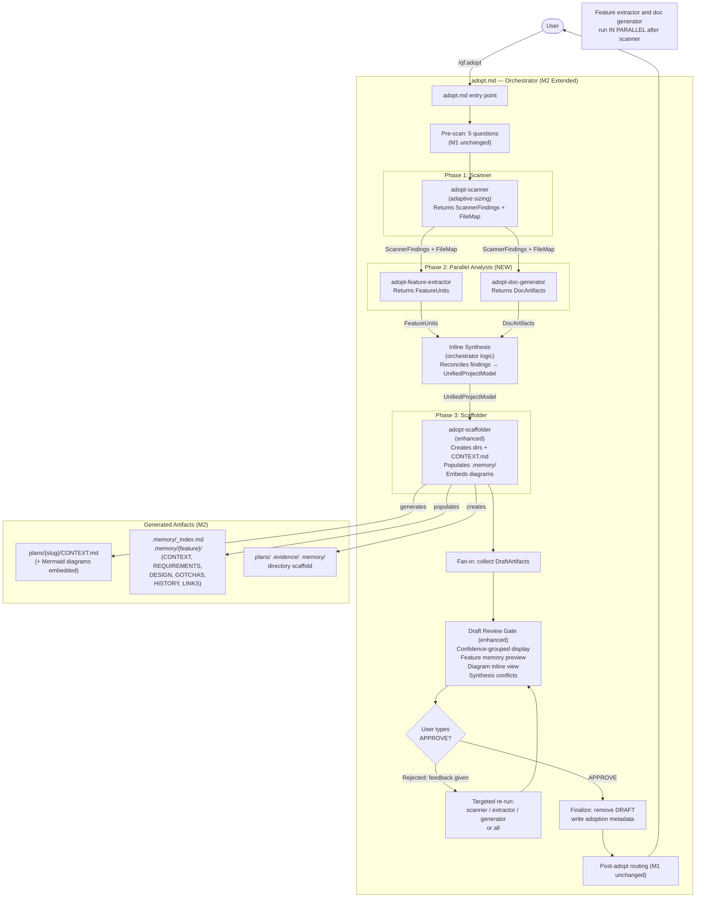

# OVERVIEW — /qf:adopt Milestone 2

## System Components

| Component | Type | Status | Responsibility |
|-----------|------|--------|----------------|
| `adopt.md` | Command / Orchestrator | **Upgraded (M2)** | Extended with Phase 2 fan-out, inline synthesis, confidence-grouped review gate. |
| `adopt-scanner` | Agent (planner / sonnet) | **Upgraded (M2)** | Adaptive sizing: determines tier, reports scan strategy, returns FileMap alongside ScannerFindings. |
| `adopt-feature-extractor` | Agent (planner / sonnet) | **New (M2)** | Identifies features/modules from scanner output. Returns FeatureUnits with inferred/confirmed status and confidence scores. |
| `adopt-doc-generator` | Agent (planner / sonnet) | **New (M2)** | Produces Mermaid diagrams (component + dependency), module map, README sections. Returns DocArtifacts. |
| Inline Synthesis | Orchestrator step (inline in adopt.md) | **New (M2)** | Reconciles FeatureUnits + DocArtifacts. Resolves conflicts via 5 rules. Produces UnifiedProjectModel. |
| `adopt-scaffolder` | Agent (fullstack-developer / sonnet) | **Upgraded (M2)** | Consumes UnifiedProjectModel. Populates `.memory/` units. Integrates diagrams into CONTEXT.md. Adds confidence badges. |
| Pre-scan Questionnaire | Inline step in adopt.md | **Unchanged (M1)** | 5 questions collected before agents spawn. |
| Draft Review Gate | Inline step in adopt.md | **Upgraded (M2)** | Presents confidence-grouped artifacts, feature memory preview, diagrams, synthesis conflicts. |
| Post-Adopt Router | Inline step in adopt.md | **Unchanged (M1)** | Finalizes artifacts, writes metadata, presents next-command choice. |

---

## M2 Extended Flowchart

---

## How M2 Extends M1

M1 flow: `Pre-scan → [Scanner ∥ Scaffolder] → Review Gate → Finalize → Route`

M2 flow: `Pre-scan → Scanner (adaptive) → [Feature Extractor ∥ Doc Generator] → Synthesis → Enhanced Scaffolder → Confidence Review → Finalize → Route`

Key extensions:
1. **Scanner** now runs first (not parallel with scaffolder) and returns a FileMap for downstream agents.
2. **Phase 2** adds two new parallel agents that receive ScannerFindings + FileMap. Scaffolder waits for synthesis before running.
3. **Synthesis** is an inline orchestrator step — not a separate agent. Five reconciliation rules produce a UnifiedProjectModel.
4. **Scaffolder** now receives UnifiedProjectModel (not raw ScannerFindings) and writes `.memory/` in addition to `CONTEXT.md`.
5. **Review Gate** enhanced with confidence-grouped display; same APPROVE/feedback mechanic.

> ⚠️ ASSUMPTION: M1 ran scanner and scaffolder truly in parallel. M2 changes the order — scanner must complete before Phase 2 agents start. This is by design (FileMap is required input for Phase 2) but adds one sequential dependency that M1 did not have.

---

## Key Design Decisions

- **Sequential pipeline, not pure parallel**: Scanner provides a shared FileMap that eliminates duplicate file discovery by Phase 2 agents. Total worst-case reads on large project: ~135 (vs ~300 for fully parallel approach).
- **Synthesis is inline**: Orchestrator holds reconciliation logic. No synthesis agent needed. Unresolvable conflicts escalate to user at review gate — no silent decisions.
- **All M1 contracts preserved**: FileMap is additive alongside ScannerFindings. DraftArtifacts is extended (new fields). No existing field removed.
- **Graceful degradation**: Phase 2 agent failures are non-blocking. If both fail, scaffolder falls back to M1 behavior (CONTEXT.md only, no `.memory/`).
- **Confidence scoring is distributed**: Each agent scores its own output. Scores flow through synthesis into scaffolder badges and review gate grouping.
