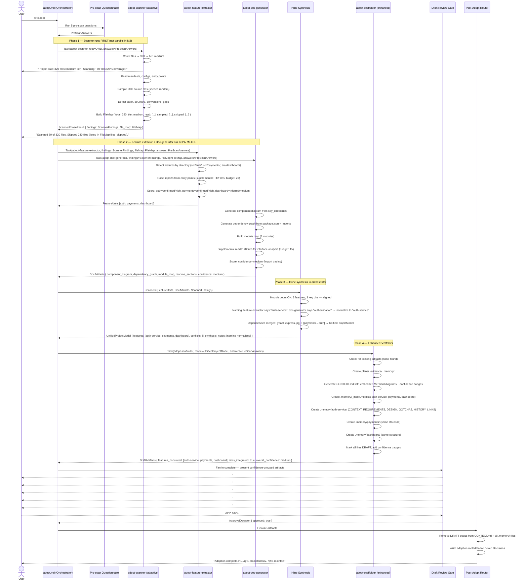
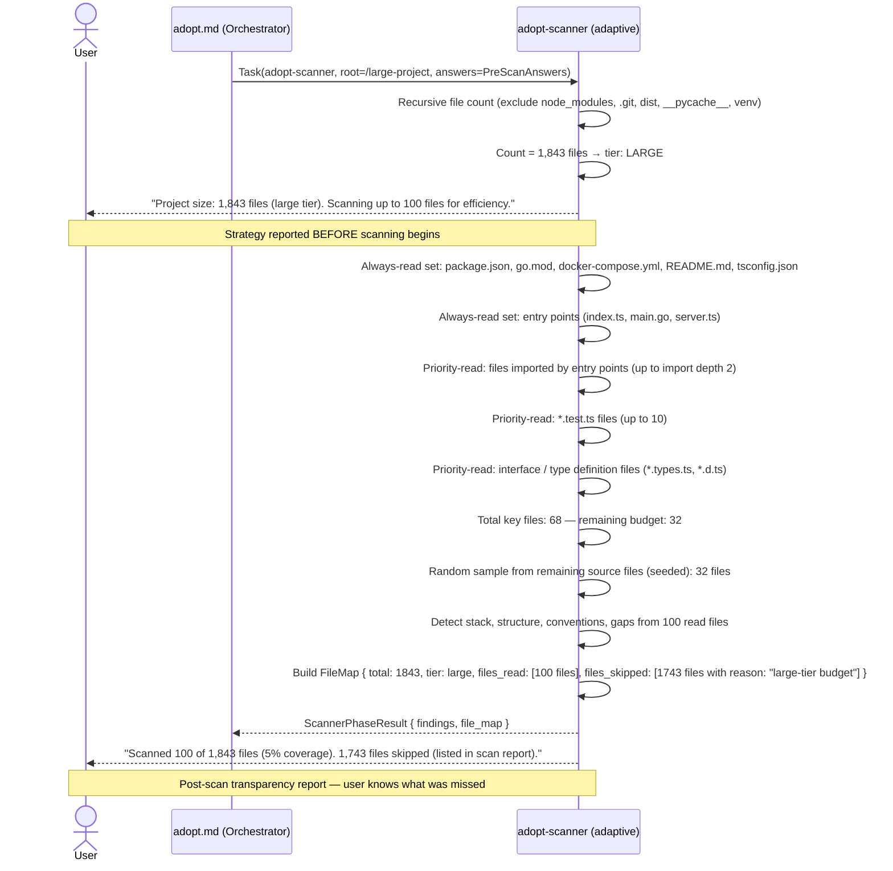
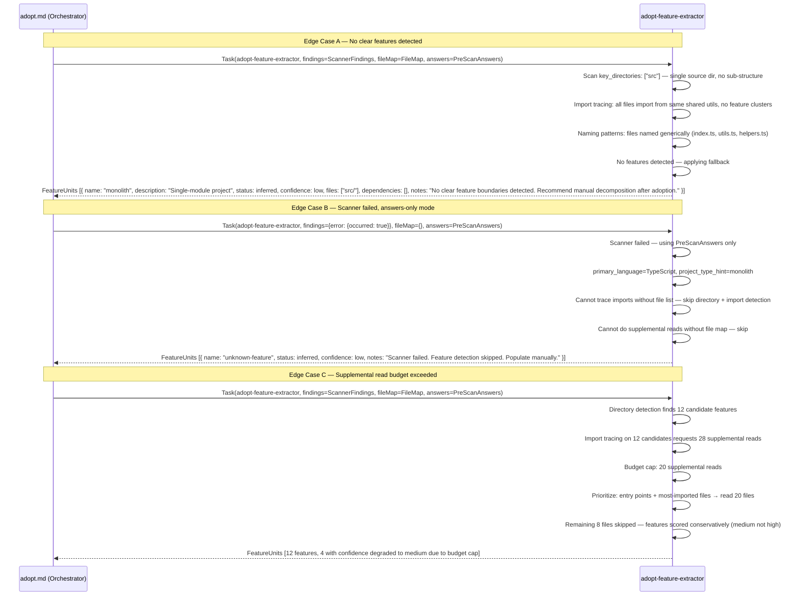
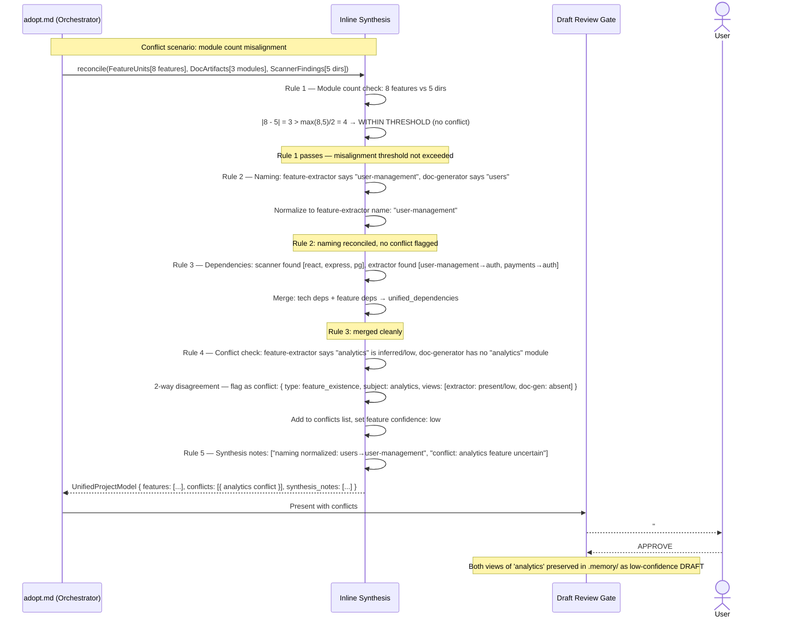
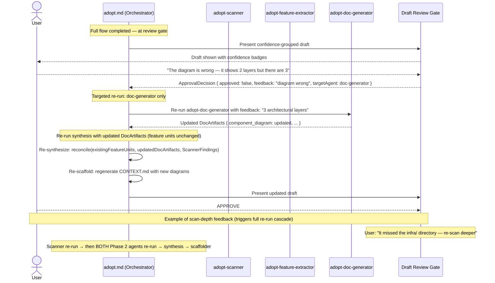

# SEQUENCES — /qf:adopt Milestone 2

All M1 sequences remain valid. M2 adds new sequences for the extended flow.

---

## Sequence 1: M2 Happy Path — Full Flow with Adaptive Scan + Feature Extraction + Docs



---

## Sequence 2: Adaptive Sizing Decision — Large Project



---

## Sequence 3: Feature Extractor Edge Cases



---

## Sequence 4: Synthesis Conflict Resolution



---

## Sequence 5: Graceful Degradation — Phase 2 Agent Failures

```mermaid
sequenceDiagram
    actor User
    participant CMD as adopt.md (Orchestrator)
    participant SCAN as adopt-scanner (adaptive)
    participant FEAT as adopt-feature-extractor
    participant DOC as adopt-doc-generator
    participant SYNTH as Inline Synthesis
    participant SCAFF as adopt-scaffolder (enhanced)
    participant GATE as Draft Review Gate

    CMD->>SCAN: Task(adopt-scanner)
    SCAN-->>CMD: ScannerPhaseResult { findings, file_map }

    Note over CMD: Phase 2 — spawn both agents in parallel
    CMD->>FEAT: Task(adopt-feature-extractor)
    CMD->>DOC: Task(adopt-doc-generator)

    FEAT-->>CMD: ERROR: agent timeout
    DOC-->>CMD: DocArtifacts { component_diagram, ... }

    Note over CMD: Feature extractor failed — non-blocking
    CMD->>CMD: featureExtractorFailed = true; features = []

    CMD->>SYNTH: reconcile(features=[], docs=DocArtifacts, scanner=ScannerFindings)
    SYNTH->>SYNTH: No features to reconcile — pass DocArtifacts through unchanged
    SYNTH->>SYNTH: synthesis_notes: ["Feature extractor failed — .memory/ population skipped"]
    SYNTH-->>CMD: UnifiedProjectModel { features: [], doc_artifacts: DocArtifacts, conflicts: [], synthesis_notes: ["..."] }

    CMD->>SCAFF: Task(adopt-scaffolder, model=UnifiedProjectModel)
    SCAFF->>SCAFF: features=[] → skip .memory/ population
    SCAFF->>SCAFF: doc_artifacts present → embed diagrams into CONTEXT.md
    SCAFF->>SCAFF: Note in DraftArtifacts: features_populated=[], docs_integrated=true
    SCAFF-->>CMD: DraftArtifacts { features_populated: [], docs_integrated: true, overall_confidence: medium }

    CMD->>GATE: Present with failure notice
    GATE-->>User: "⚠️ Feature extractor failed. .memory/ units not populated.\nDiagrams and module map are available.\nYou can re-run feature extraction."
    User-->>GATE: "re-run feature extraction"
    GATE-->>CMD: ApprovalDecision { approved: false, feedback: "re-run feature extraction", targetAgent: feature-extractor }

    CMD->>FEAT: Re-run adopt-feature-extractor (with same inputs)
    FEAT-->>CMD: FeatureUnits [auth, payments, dashboard]
    CMD->>SYNTH: Re-reconcile with features
    SYNTH-->>CMD: Updated UnifiedProjectModel
    CMD->>SCAFF: Re-run adopt-scaffolder with updated model
    SCAFF-->>CMD: Updated DraftArtifacts { features_populated: [auth, payments, dashboard] }

    CMD->>GATE: Present updated draft
    User-->>GATE: APPROVE
```

---

## Sequence 6: Rejection Loop — Extended Re-run Table (M2)


